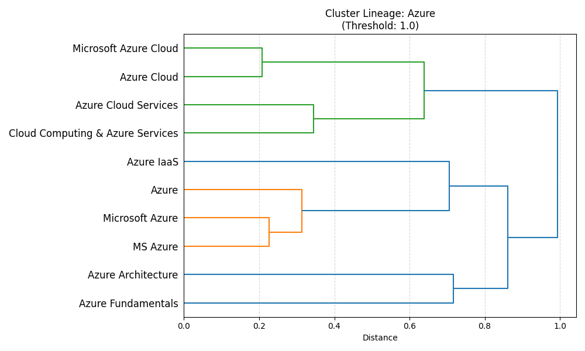
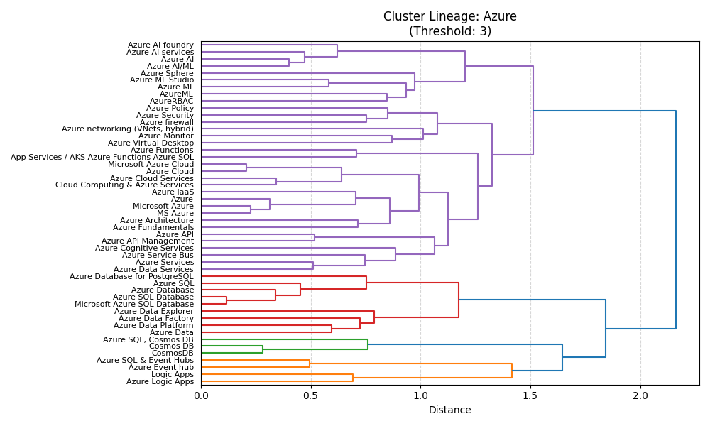
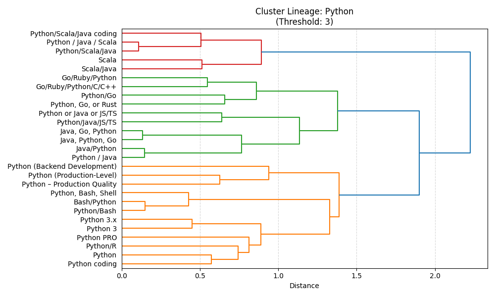

# Tech Normalizer

## Problem 
Companies use different names for the same technology, and it can be confusing. For example:
- "Microsoft Azure" and "Azure" are the same thing.

I want to group these different names into clusters that represent the same skill or technology.

---

## What I Did
1. I used **clustering** methods to group similar names.
2. I made **dendrograms** to see how agglomerative clustering works.
3. I tested some other methods to figure out what works best.

---

## Clustering Methods

### Agglomerative Clustering
- This method builds clusters step-by-step (small groups first, then bigger).
- I tested different thresholds to find the best grouping.

Examples:
- At threshold 1 (`t_1.0`), the cluster for `Azure` is too small:
  - 
- At threshold 3 (`t_3.0`), the `Azure` cluster is better:
  - 
- But I cant do threshold 3 everywhere becouse for example at threshold 3:
  - `Scala` gets grouped with `Python`:
    - 

### DBSCAN
- This method can handle clusters of different sizes.
- But it has problems with clusters that have different densities (spread out vs compact).

### HDBSCAN
- I used this because DBSCAN wasn’t perfect.
- Still, there is more work needed.

---

## Problems
1. **Cluster Search:**
   - I wrote a `trace_specific_cluster` function, but it can be faster. It calculates clusters every time, but it should only calculate once.
2. **My Knowledge:**
   - I don’t know all the technologies, so some clusters might not be super accurate.

---

## What’s Next
- Make the code run faster.
- Fix the problems with clusters for different densities.
